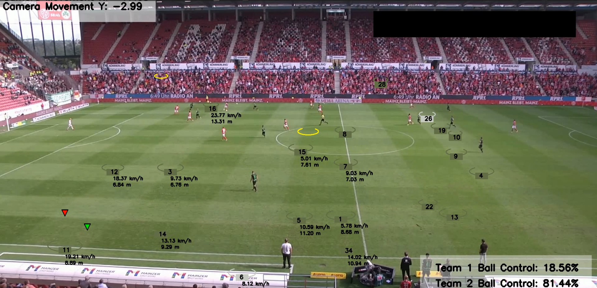

# Football Analysis

This repository contains an advanced football match analysis project that leverages state-of-the-art computer vision techniques and machine learning models to extract and analyze key insights from football match videos.

## Project Overview

The goal of this project is to build a sophisticated system that automates the analysis of football (soccer) games using deep learning and computer vision. It tracks player movements, detects key events, and provides data-driven insights from the match, enabling teams, coaches, and analysts to make informed decisions based on objective data.



### Features

- **Player Detection and Tracking**: Utilizes YOLO (You Only Look Once) for real-time object detection to identify players on the field. OpenCV is then employed to track their movements throughout the game, providing a comprehensive view of player positioning and movement patterns.

- **Event Detection**: Identifies and timestamps key events such as goals, shots on target, fouls, and tackles using advanced computer vision techniques. This feature allows for quick compilation of match highlights and detailed event analysis.

- **Data Visualization**: Generates heatmaps of player movement, offering insights into team formations, player roles, and strategic positioning. Additionally, it provides visual representations of possession statistics, pass networks, and other crucial match data.

- **Team and Player Performance Analysis**: Calculates and presents a wide array of statistics including distance covered by players, number of passes completed, pass accuracy, shots taken, and other metrics to evaluate individual and team performance objectively.

## Tools & Technologies

This project leverages cutting-edge technologies in computer vision and machine learning:

- **YOLOv5**: State-of-the-art, real-time object detection framework, fine-tuned for detecting players, referees, and the ball with high accuracy.

- **OpenCV**: Powerful computer vision library used for video processing, object tracking, and image manipulation tasks.

- **PyTorch**: Deep learning framework used to implement and train the YOLO model, allowing for efficient GPU acceleration and custom model architectures.

- **Matplotlib/Seaborn**: Data visualization libraries used for creating high-quality, informative visualizations of match data, including heatmaps, event timelines, and statistical charts.

- **Pandas**: Data manipulation library used for efficient handling and analysis of large datasets generated from match analysis.

## Project Structure

```
.
├── data/                  # Directory containing match video files and datasets
│   ├── raw_videos/        # Raw match footage
│   └── processed_data/    # Preprocessed data and extracted features
├── models/                # Pre-trained models used for detection and tracking
│   ├── yolov5s.pt         # YOLOv5 small model
│   └── player_tracker.pth # Custom player tracking model
├── notebooks/             # Jupyter notebooks with exploratory analysis and experiments
│   ├── data_exploration.ipynb
│   ├── model_training.ipynb
│   └── results_analysis.ipynb
├── scripts/               # Python scripts for data processing, model training, and evaluation
│   ├── preprocess_video.py
│   ├── train_model.py
│   ├── detect_events.py
│   └── analyze_match.py
├── output/                # Directory for storing outputs such as visualizations and analysis reports
│   ├── heatmaps/
│   ├── event_detections/
│   └── match_reports/
├── tests/                 # Unit tests and integration tests
├── requirements.txt       # List of project dependencies
├── setup.py               # Script for installing the project as a package
├── .gitignore             # Specifies intentionally untracked files to ignore
├── LICENSE                # Project license information
└── README.md              # Project documentation (this file)
```

## Installation

Follow these steps to set up the project environment:

1. Clone the repository:

   ```bash
   git clone https://github.com/abdullahtarek/football_analysis.git
   cd football_analysis
   ```

2. Create and activate a virtual environment:

   ```bash
   python -m venv env
   source env/bin/activate  # On Windows: env\Scripts\activate
   ```

3. Install the required dependencies:

   ```bash
   pip install -r requirements.txt
   ```

4. Download pre-trained models:
   ```bash
   python scripts/download_models.py
   ```

## Results

The analysis produces a comprehensive set of results, including:

- **Player heatmaps**: High-resolution visualizations of player positions and movement patterns throughout the match, offering insights into team formations and individual player roles.
- **Event detection**: Timestamped list of key match events (goals, fouls, corners, etc.) with corresponding video segments for quick review.
- **Possession analysis**: Detailed breakdown of possession statistics, including team-wise and player-wise possession percentages.
- **Pass networks**: Visualizations of passing patterns and key play-makers within each team.
- **Player performance metrics**: Comprehensive statistics for each player, including distance covered, sprints, passes completed, and defensive actions.
- **Team analytics**: Aggregated team performance data, tactical analysis, and comparative statistics between the two teams.

## Contributing

We welcome contributions to improve the Football Analysis project! Here's how you can contribute:

1. Fork the repository
2. Create a new branch (`git checkout -b feature/AmazingFeature`)
3. Make your changes
4. Commit your changes (`git commit -m 'Add some AmazingFeature'`)
5. Push to the branch (`git push origin feature/AmazingFeature`)
6. Open a Pull Request

Please ensure your code adheres to our coding standards and includes appropriate tests.

## Acknowledgments

- YOLOv5 developers for their excellent object detection framework
- OpenCV community for their comprehensive computer vision library
- PyTorch team for their powerful deep learning platform
